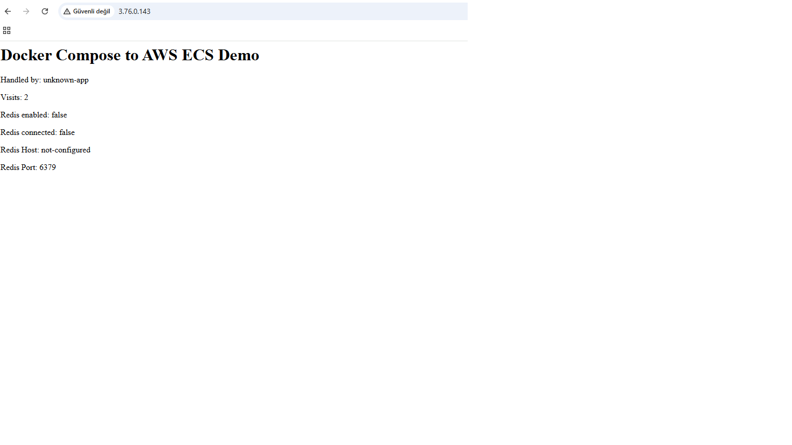
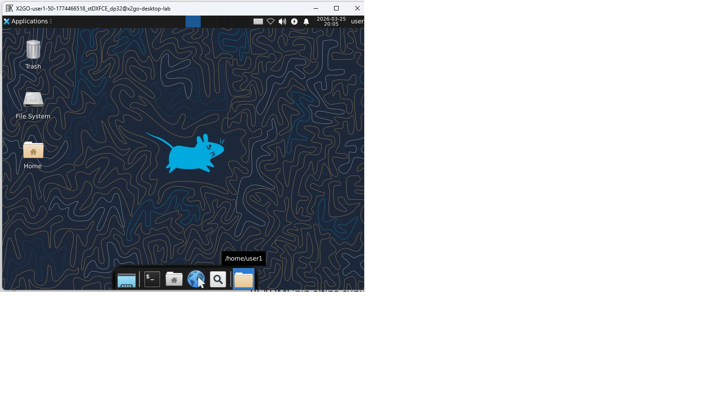
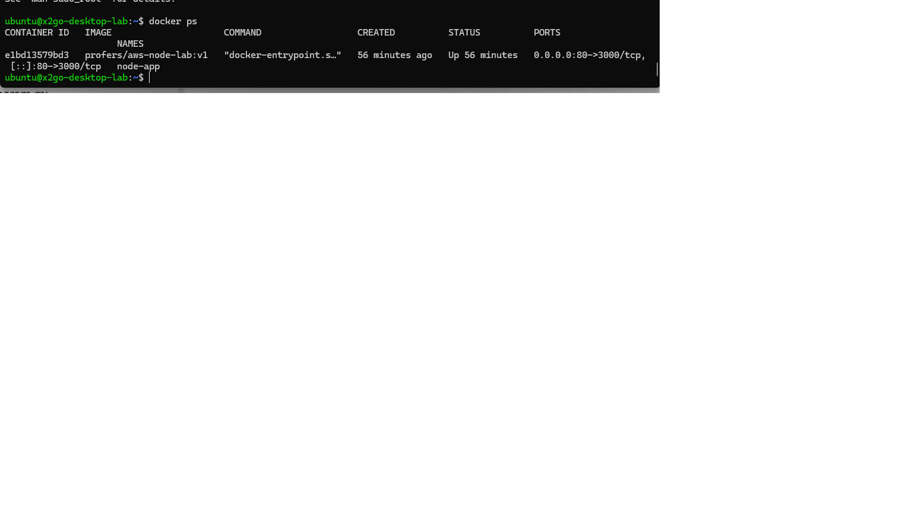
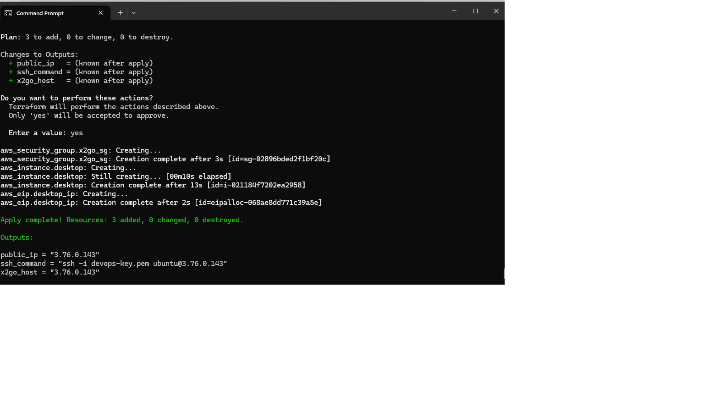

# AWS Terraform Multi-User Remote Desktop & Docker Lab

This project demonstrates how to provision and configure a fully automated multi-user Linux remote desktop environment on AWS using Terraform, Docker, and X2Go.

The entire infrastructure is deployed using Terraform (Infrastructure as Code), and the EC2 instance is automatically configured using a user-data Bash script. Docker is installed automatically and a Dockerized Node.js web application is deployed on instance startup.

## Architecture Overview

- AWS EC2 (Ubuntu)
- Terraform (Infrastructure as Code)
- XFCE Desktop Environment
- X2Go Remote Desktop (Multi-user access)
- Docker & Docker Compose
- Node.js Web Application (Dockerized)
- User-data script for automatic provisioning# AWS Terraform Multi-User Remote Desktop & Docker Lab

This project demonstrates how to provision a fully automated multi-user Linux remote desktop environment on AWS using Terraform, Docker, and X2Go.

## Project Architecture

- AWS EC2 (Ubuntu)
- Terraform (Infrastructure as Code)
- XFCE Desktop Environment
- X2Go Remote Desktop (Multi-user access)
- Docker & Docker Compose
- Node.js Application (Dockerized)
- Docker Hub (Image Repository)
- User-data script (Automatic provisioning)

## What This Project Does

When Terraform is applied:

1. AWS EC2 instance is created
2. Security Groups are configured (SSH, HTTP)
3. XFCE desktop environment is installed
4. X2Go server is installed for remote desktop access
5. Multiple Linux users are created
6. Docker and Docker Compose are installed
7. Node.js application image is pulled from Docker Hub
8. Docker container is started automatically
9. Web application becomes accessible via public IP
10. Users can connect via remote desktop (X2Go)

## Technologies Used

- AWS EC2
- Terraform
- Linux (Ubuntu)
- Docker
- Docker Compose
- Node.js
- X2Go
- XFCE
- Bash (user-data automation)
- Cloud-init

## How to Deploy

```bash
terraform init
terraform apply

After deployment:

Web App: http://<EC2-Public-IP>
Remote Desktop: X2Go Client
SSH: ssh ubuntu@<EC2-Public-IP>
Docker Image

The Node.js application is containerized and hosted on Docker Hub.

Author

Hamza Terzi
Management Information Systems Graduate
Cloud & DevOps Enthusiast

## Project Screenshots

### Web Application


### X2Go Remote Desktop


### Docker Container


### Terraform Deployment

